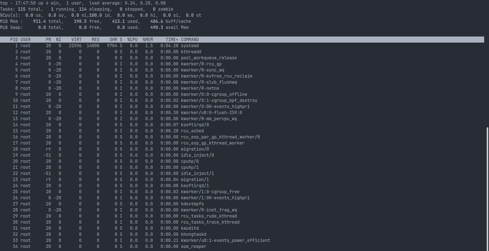
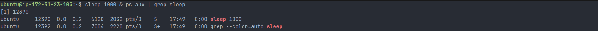
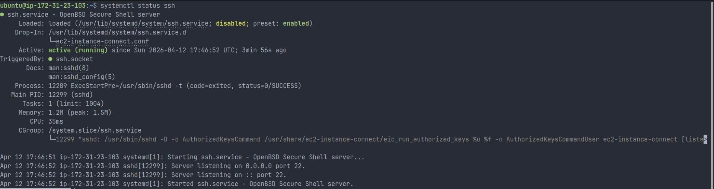
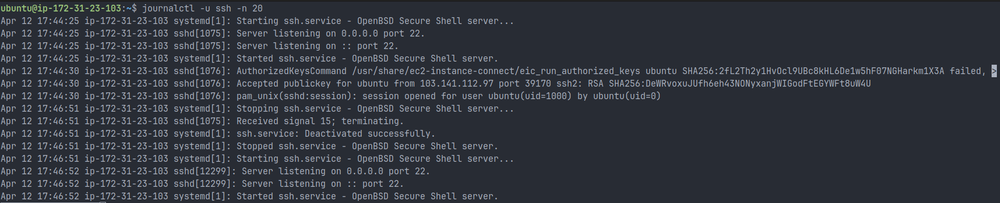

# Day 02 – Linux Architecture, Processes, and systemd

## Linux Architecture (Under the Hood)

- **Kernel**
  - Core of the OS (controls hardware)
  - Manages CPU, memory, disk, and devices
  - Handles system calls from applications

- **User Space**
  - Where applications run (bash, ssh, nginx, docker)
  - Users interact with the system here

- **systemd (PID 1)**
  - First process started by the kernel
  - Manages all services and system processes

---

## Process Management

- A **process** = running instance of a program
- Each process has:
  - **PID** (Process ID)
  - **PPID** (Parent Process ID)

### Process Lifecycle

1. Created using `fork()`
2. Program loaded using `exec()`
3. Runs until completed or terminated

### Process States

- **R (Running)** – actively using CPU
- **S (Sleeping)** – waiting for event (most common)
- **D (Uninterruptible Sleep)** – waiting on I/O (disk/network)
- **Z (Zombie)** – finished but not cleaned by parent
- **T (Stopped)** – paused manually (SIGSTOP)

---

## systemd (Service Manager)

- Default init system in modern Linux

### Responsibilities

- Starts services during boot
- Restarts failed services automatically
- Tracks service states
- Manages logs via `journald`

### Why systemd matters in DevOps

- Faster system boot (parallel startup)
- Automatic service recovery
- Centralized service control

---

## Daily DevOps Commands

```bash
ps aux                  # List all processes
 top                     # Real-time system monitoring
 kill -9 <PID>           # Force kill process
 systemctl status ssh    # Check service status
 journalctl -u ssh -n 20 # View recent logs
```

---

## Hands-on Observations (My Practice)

### 1. Live Monitoring using `top`

- Observed system load and running processes
- Most processes were in **Sleeping (S)** state
- System load was low → system healthy



### 2. Created My Own Process

```bash
sleep 1000 &
ps aux | grep sleep
```

- Process Name: `sleep`
- State: `S (Sleeping)`
- Verified background execution



### 3. Service Inspection using systemd

```bash
systemctl status ssh
```

- Service: SSH
- Status: **active (running)**
- Verified Main PID and logs



### 4. Log Analysis

```bash
journalctl -u ssh -n 20
```

- Observed:
  - Service start/stop logs
  - SSH login activity



---

## Real DevOps Use Case

### Scenario: Application is Down

```bash
systemctl status nginx
```

- Check if service is running

```bash
journalctl -u nginx -n 50
```

- Identify errors from logs

```bash
systemctl restart nginx
```

- Restart service

---

## Key Takeaways

- Kernel manages hardware and resources
- User space runs applications
- systemd manages services and logs
- Most processes stay in **sleeping state** to save CPU
- Logs + systemctl = primary debugging tools

---

## Mini Practice (Self-Test)

1. Run `ps aux` and identify PID & state
2. Start a background process (`sleep 500 &`)
3. Kill it using `kill`
4. Check a service using `systemctl`

---

## DevOps Insight

> In production, most issues are related to process crashes, resource exhaustion, or service failures — all of which can be debugged using `ps`, `top`, and `systemctl`.
