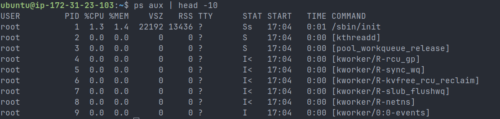
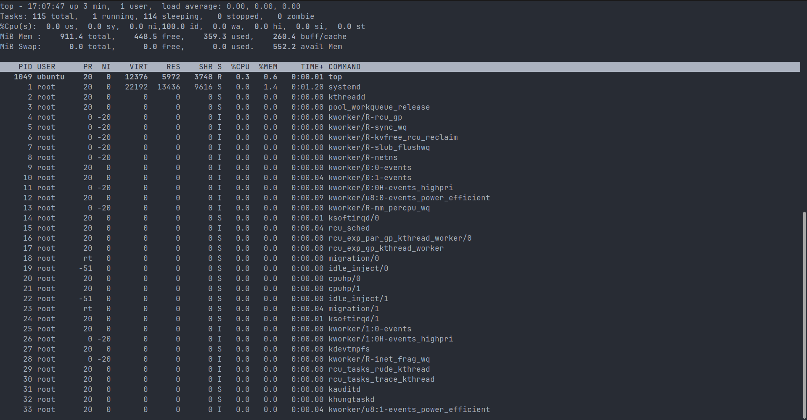
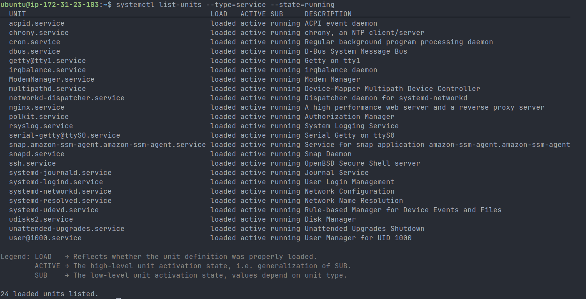
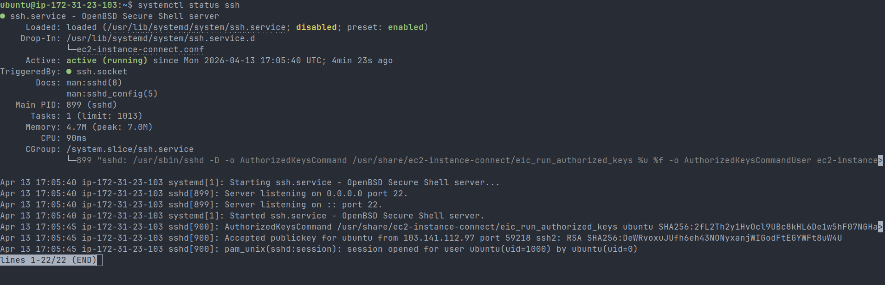
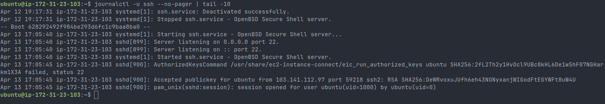
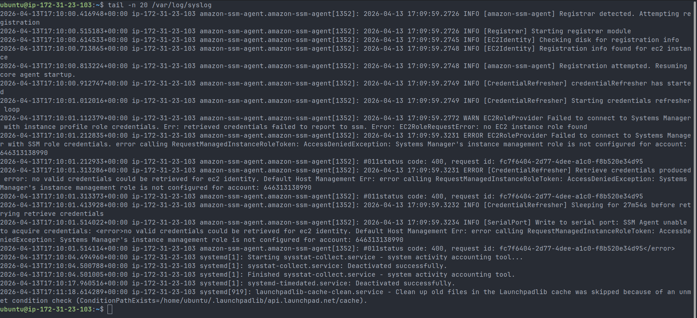
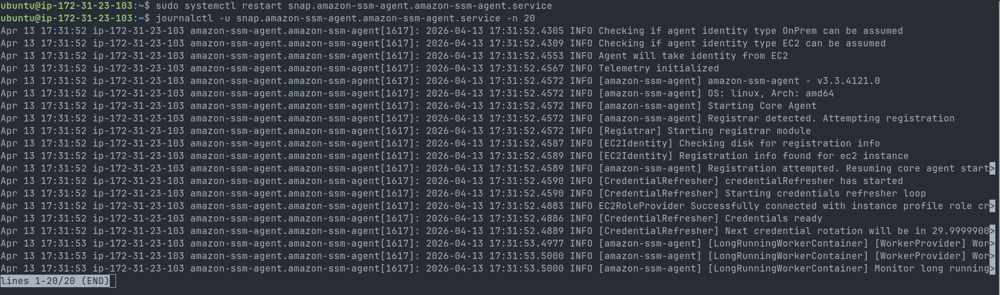

# Day 04 – Linux Practice: Processes and Services

## Objective

Hands-on practice with Linux processes, services, and logs. Also includes a real-world debugging scenario on AWS EC2.

---

# 1. Process Checks

## Command 1: View Running Processes

```bash
ps aux | head -10
```

### Output

```
USER       PID %CPU %MEM    VSZ   RSS TTY      STAT START   TIME COMMAND
root         1  1.3  1.4  22192 13436 ?        Ss   17:04   0:01 /sbin/init
root         2  0.0  0.0      0     0 ?        S    17:04   0:00 [kthreadd]
```



### Observations

- PID 1 is `systemd` (init process)
- Kernel threads shown as `[kworker/*]`
- `STAT` values:
  - `S` = Sleeping
  - `I` = Idle kernel thread

---

## Command 2: Real-Time Monitoring

```bash
top
```



### Observations

- Load Average: `0.00` → system idle
- CPU: `100% id` → no CPU usage
- Memory: ~911MB total, ~359MB used
- Helps identify high resource usage in real time

---

# 2. Service Checks

## Command 3: List Running Services

```bash
systemctl list-units --type=service --state=running
```



### Observations

- `nginx.service` → web server
- `ssh.service` → remote access
- `snap.amazon-ssm-agent` → AWS SSM agent

---

## Command 4: Check SSH Service

```bash
systemctl status ssh
```



### Observations

- Service is active and running
- Listening on port 22
- Using key-based authentication

---

# 3. Log Checks

## Command 5: SSH Logs

```bash
journalctl -u ssh --no-pager | tail -10
```



### Observations

- Shows login attempts
- Displays authentication logs

---

## Command 6: System Logs

```bash
tail -n 20 /var/log/syslog
```



### Observations

- Found AWS SSM agent errors
- Indicates deeper system/cloud issue

---

# 4. Real Troubleshooting Scenario (AWS SSM Agent)

## Issue

SSM Agent was running but failing with:



```
AccessDeniedException
Failed to connect to Systems Manager
```

---

## Step 1: Checked Service

```bash
systemctl status snap.amazon-ssm-agent.amazon-ssm-agent.service
```

- Service was running

---

## Step 2: Checked Logs

```bash
journalctl -u snap.amazon-ssm-agent.amazon-ssm-agent.service -n 20
```

### Error Found

```
EC2RoleProvider Failed to connect
AccessDeniedException
```

---

## Step 3: Root Cause

- IAM role was NOT attached to EC2 instance
- Incorrectly added policy to IAM user instead of EC2 role

---

## Step 4: Fix

1. Created IAM Role for EC2
2. Attached policy:
   - `AmazonSSMManagedInstanceCore`

3. Attached role to EC2 instance
4. Restarted SSM agent

```bash
sudo systemctl restart snap.amazon-ssm-agent.amazon-ssm-agent.service
```

---

## Step 5: Verification

```bash
journalctl -u snap.amazon-ssm-agent.amazon-ssm-agent.service -n 20
```

### Success Logs

```
Successfully connected with instance profile role
Credentials ready
```

---

# 5. Key Learnings

- `ps` gives snapshot of processes
- `top` provides real-time monitoring
- `systemctl` manages services
- `journalctl` is critical for debugging

---

# 6. DevOps Insights

- Not all issues are OS-level
- Cloud IAM plays a major role in system behavior
- IAM User ≠ IAM Role
- Always check logs before restarting blindly

---

# 7. Important Concept

## How EC2 Gets Credentials

- EC2 uses **Instance Metadata Service (IMDS)**
- IAM Role provides temporary credentials
- No need for hardcoded access keys

---

# 8. Conclusion

This exercise helped me:

- Understand Linux processes and services
- Debug real-world cloud issue
- Learn IAM role importance in AWS

This is a practical DevOps workflow:
**Observe → Debug → Fix → Verify**
