# Day 05 – Linux Troubleshooting Runbook

## Target Service

Service: SSH (sshd)

---

## 1. Environment Basics

### Command 1

```bash
uname -a
```

**Output (trimmed):**

```
Linux ip-172-31-23-103 6.17.0-1010-aws ... x86_64 GNU/Linux
```

**Observation:** AWS-based Ubuntu system running modern kernel.

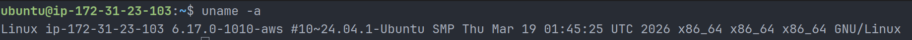

### Command 2

```bash
cat /etc/os-release
```

**Output (trimmed):**

```
Ubuntu 24.04.4 LTS (Noble)
```

**Observation:** Stable LTS OS suitable for production workloads.

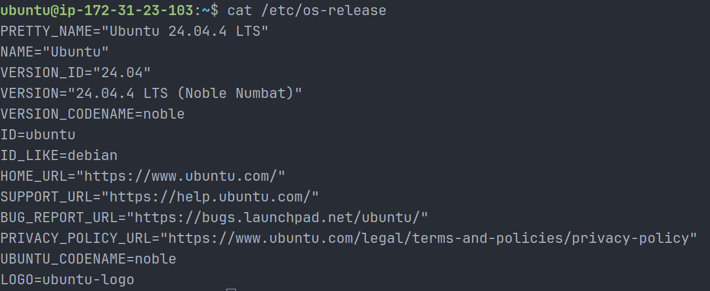

---

## 2. Filesystem Sanity

### Command 3

```bash
mkdir /tmp/runbook-demo && ls /tmp
```

**Observation:** Directory created → filesystem writable.

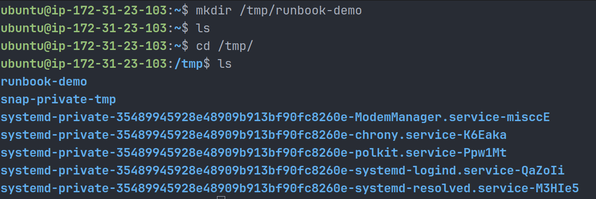

### Command 4

```bash
cp /etc/hosts /tmp/runbook-demo/hosts-copy && ls -l /tmp/runbook-demo
```

**Observation:** File copy successful → read/write operations working.

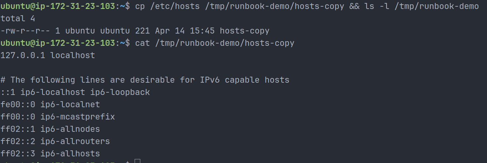

---

## 3. CPU & Memory Snapshot

### Command 5

```bash
top
```

**Output (key lines):**

```
load average: 0.00, 0.00, 0.00
%Cpu(s): 99.8 id
```

**Observation:**

- System under no load
- CPU mostly idle

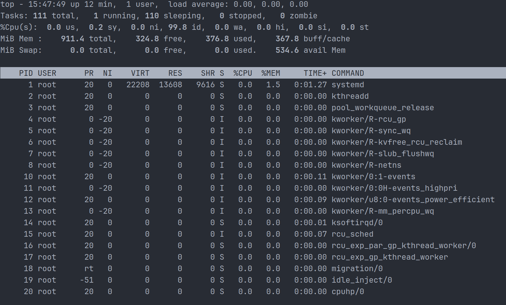

### Command 6

```bash
free -h
```

**Output:**

```
911MB total | 534MB available
```

**Observation:** Memory usage normal, no swap usage.

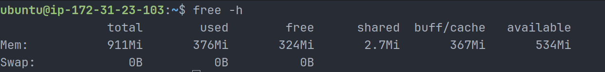

---

## 4. Disk & IO Snapshot

### Command 7

```bash
df -h
```

**Output:**

```
/dev/root 19G 2.4G 17G 13%
```

**Observation:** Disk usage low → no storage pressure.

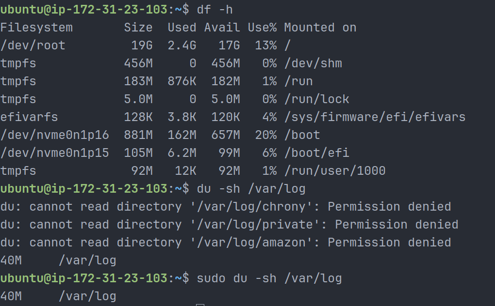

### Command 8

```bash
sudo du -sh /var/log
```

**Output:**

```
40M /var/log
```

**Observation:** Log size reasonable.

---

## 5. Network Snapshot

### Command 9

```bash
ss -tulpn
```

**Observation:**

- SSH → port 22
- HTTP → port 80
- No suspicious ports

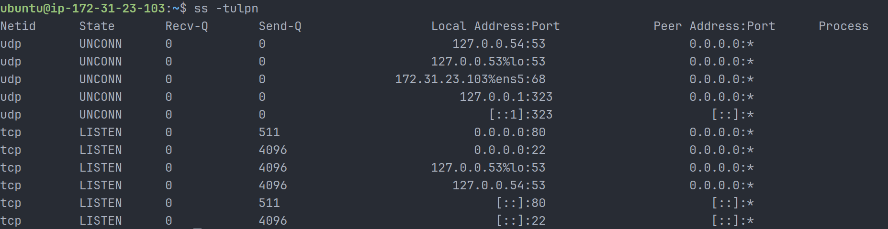

### Command 10

```bash
ping -c 3 localhost
```

**Observation:**

- 0% packet loss
- Network stack working

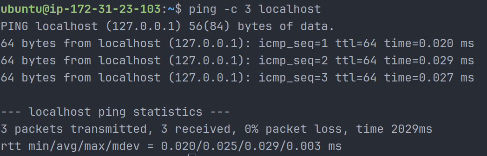

---

## 6. Logs Reviewed

### Command 11

```bash
journalctl -u ssh -n 50
```

**Observation:** SSH restarted multiple times but no errors.

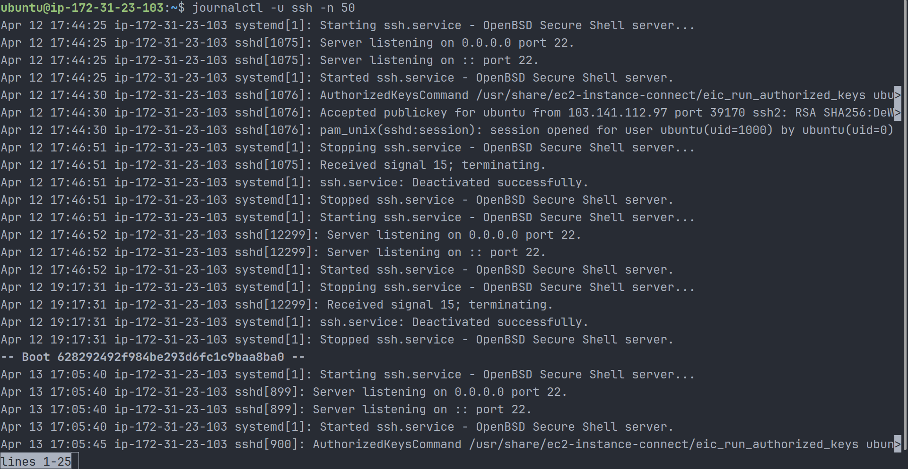

### Command 12

```bash
tail -n 50 /var/log/auth.log
```

**Observation:**

- Normal cron activity
- Sudo commands executed
- No failed login attempts

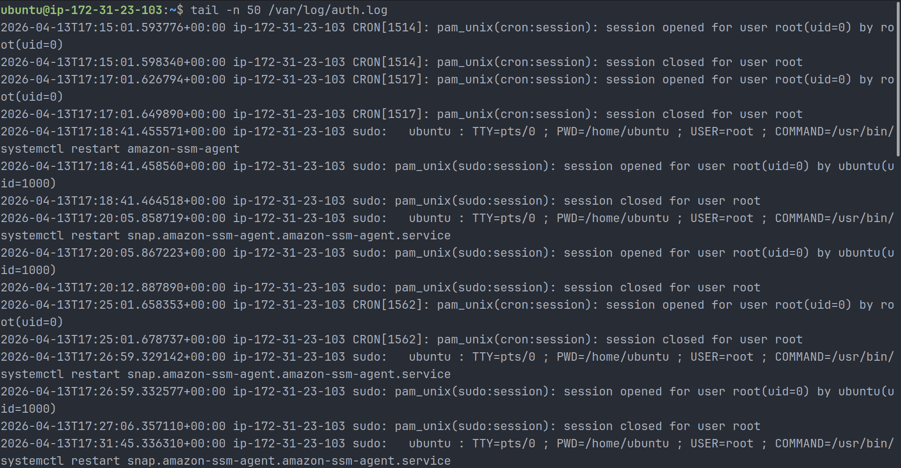

---

## 7. Process-Level Debugging

### Command 13

```bash
ps -o pid,pcpu,pmem,comm -p 1364
```

**Output:**

```
1364 0.0 0.8 sshd
```

**Observation:** sshd idle and healthy.

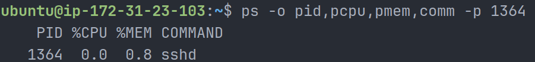

### Command 14

```bash
sudo strace -p 1364
```

**Observation:** sshd waiting on poll() → normal idle behavior.

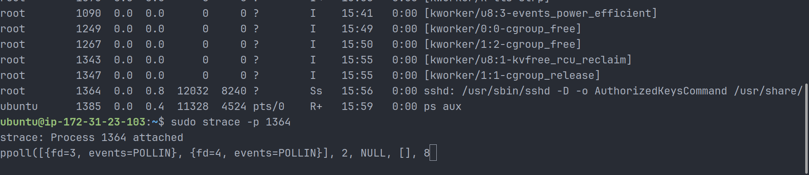

---

## 8. Security Check

### Command 15

```bash
sudo ufw status
```

**Initial Observation:** Firewall inactive (risk identified)

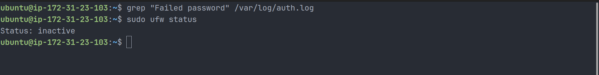

### Fix Applied

```bash
sudo ufw allow 22
sudo ufw enable
```

**Final Observation:** Firewall enabled → system secured.

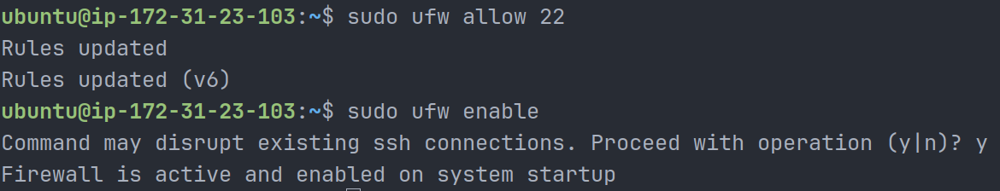

---

## 9. Quick Findings

- System resources healthy (CPU, memory, disk)
- SSH service stable and listening
- No suspicious logs
- sshd process idle and functioning normally
- Firewall was disabled → fixed during troubleshooting

---

## 10. If This Worsens (Next Steps)

1. Restart SSH service

```bash
sudo systemctl restart ssh
```

2. Increase logging

- Set `LogLevel DEBUG` in `/etc/ssh/sshd_config`

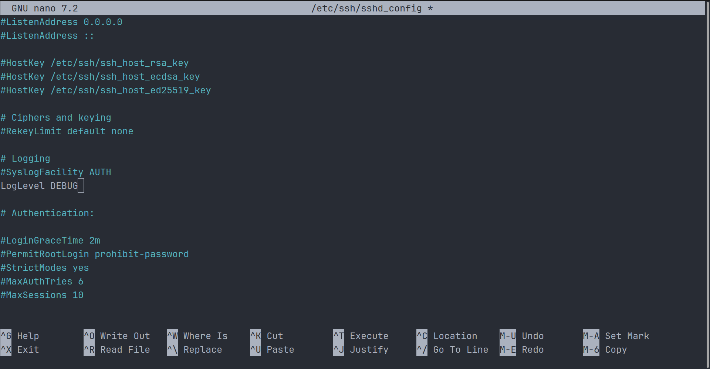

3. Monitor process

```bash
pidstat -p 1364 1
```

4. Investigate failed logins

```bash
grep "Failed password" /var/log/auth.log
```

5. Deep debug

```bash
sudo strace -p <pid>
```

---

## Conclusion

This runbook demonstrates a structured troubleshooting approach covering system health, service validation, logs, and security. The system is healthy, and a key security improvement (firewall enablement) was applied.
