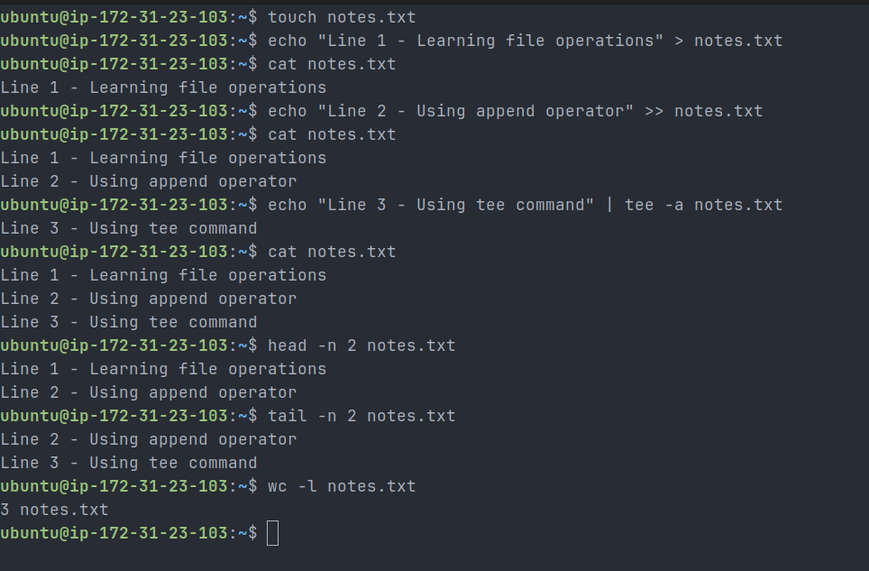

# Day 06 – Linux Fundamentals: File Read/Write Practice

## Objective

Practice basic file operations using fundamental Linux commands.

---

## Commands Executed

```bash
# Create a file
touch notes.txt

# Write first line (overwrite)
echo "Line 1 - Learning file operations" > notes.txt

# Append second line
echo "Line 2 - Using append operator" >> notes.txt

# Append third line using tee
echo "Line 3 - Using tee command" | tee -a notes.txt

# Read full file
cat notes.txt

# Read first 2 lines
head -n 2 notes.txt

# Read last 2 lines
tail -n 2 notes.txt

# Count number of lines
wc -l notes.txt
```

## Screenshot

Terminal output from the file read/write practice:



---

## Output File (notes.txt)

```text
Line 1 - Learning file operations
Line 2 - Using append operator
Line 3 - Using tee command
```

---

## Key Learnings

- `>` overwrites the file content
- `>>` appends new content to the file
- `tee -a` appends while also displaying output
- `cat` reads entire file content
- `head` and `tail` help inspect parts of a file
- `wc -l` counts number of lines in a file

---

## Real-World DevOps Use

- Monitoring logs using `tail -f`
- Appending logs safely using `>>`
- Writing and updating configuration files
- Debugging application behavior through log inspection

---

## Important Insight

- Using `>` on existing files can **overwrite critical data**
- Using `>>` ensures data is **preserved and appended safely**
- In production systems, incorrect use of `>` can break services (e.g., overwriting config files)

---

## Conclusion

This exercise strengthened my understanding of file handling in Linux. These commands are essential for log management, debugging, and automation in real-world DevOps workflows.
