# Day 07 – Linux File System Hierarchy & Scenario-Based Practice

## Part 1: Linux File System Hierarchy

### Core Directories

#### `/` (Root)

- Base of the entire Linux file system
- Everything starts from here
- Example: bin, etc, home
- I would use this when navigating the system

#### `/home`

- Contains user home directories
- Example: /home/ubuntu
- I would use this when accessing user files

#### `/root`

- Home directory for root user
- Contains admin-level configs and scripts
- I would use this when performing admin tasks

#### `/etc`

- Stores system-wide configuration files
- Example: /etc/hostname, /etc/passwd
- I would use this when modifying system configs

#### `/var/log`

- Stores system and application logs
- Example: syslog, auth.log
- I would use this when troubleshooting issues

#### `/tmp`

- Stores temporary files
- Cleared periodically by system
- I would use this for temporary/debug data

---

### Additional Directories

#### `/bin`

- Essential system binaries
- Example: ls, cp, mv
- I would use this for basic commands

#### `/usr/bin`

- User-level binaries
- Example: python, git
- I would use this for installed tools

#### `/opt`

- Third-party applications
- Example: custom software installations
- I would use this for managing external apps

---

## Part 2: Scenario-Based Practice

### Scenario 1: Service Not Starting

Step 1: Check service status

```
sudo systemctl status myapp
```

Why: Check if service is failed or inactive

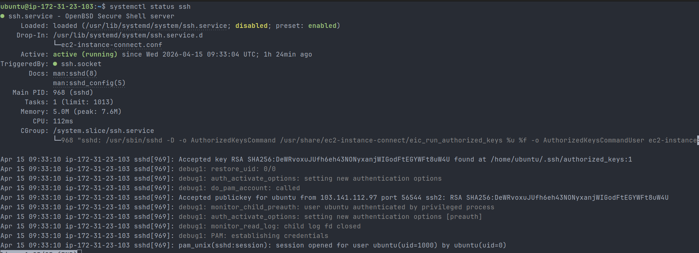

Step 2: Check logs

```
journalctl -u myapp -n 50
```

Why: Identify error messages

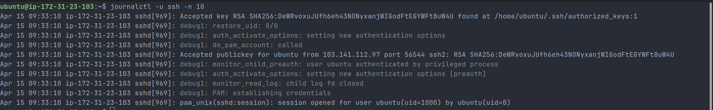

Step 3: Check if enabled

```
systemctl is-enabled myapp
```

Why: Verify auto start on boot

Step 4: Restart service

```
sudo systemctl restart myapp
```

Why: Attempt recovery

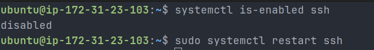

Step 5: Check all services

```
systemctl list-units --type=service | grep myapp
```

Why: Confirm service exists

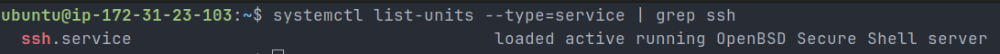

---

### Scenario 2: High CPU Usage

Step 1: Check live usage

```
top
```

Why: Identify high CPU processes

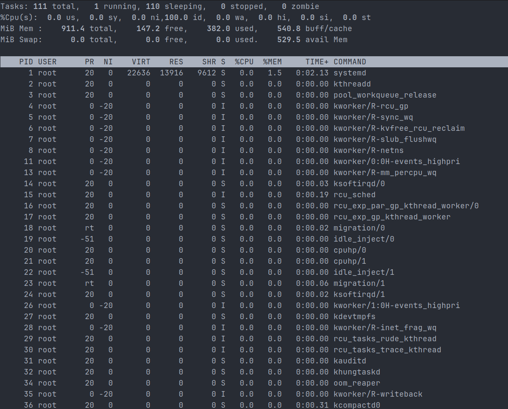

Step 2: Sort processes

```
ps aux --sort=-%cpu | head -10
```

Why: Find top CPU consumers

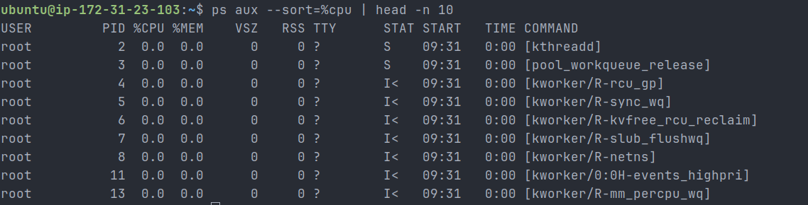

Step 3: Analyze PID

- Identify problematic process

Conclusion:

- CPU usage was normal (mostly idle)

---

### Scenario 3: Finding Service Logs

Step 1: Check service

```
sudo systemctl status docker
```

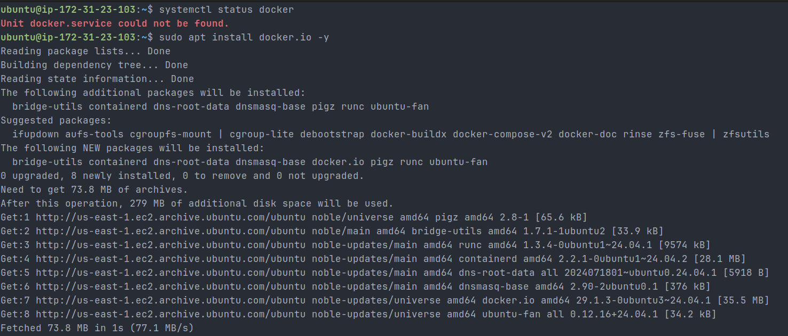

After installation and verification:

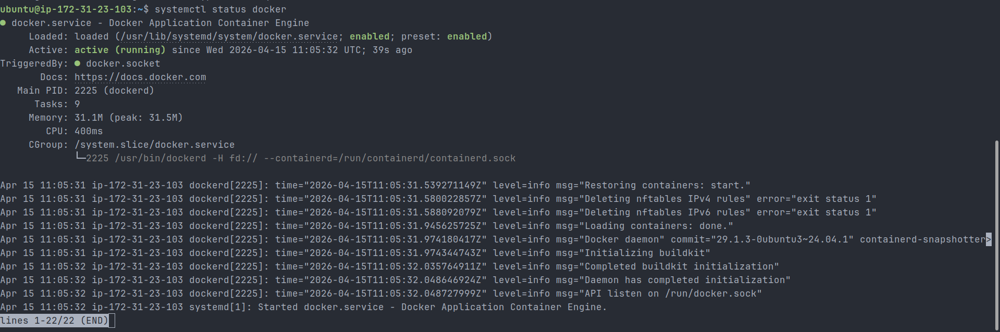

Step 2: View logs

```
journalctl -u docker -n 50
```

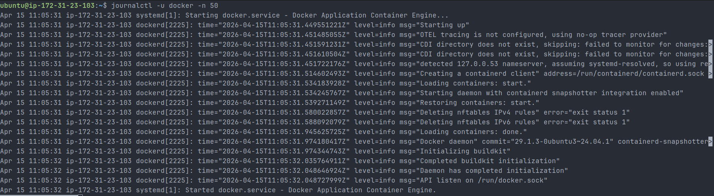

Step 3: Follow logs

```
journalctl -u docker -f
```

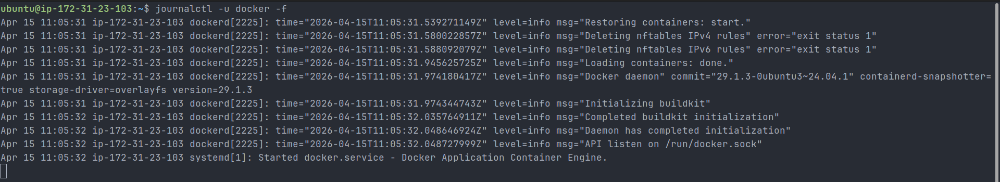

---

### Scenario 4: File Permission Issue

Step 1: Check permissions

```
ls -l /home/user/backup.sh
```

Step 2: Add execute permission

```
chmod +x backup.sh
```

Step 3: Verify

```
ls -l backup.sh
```

Step 4: Execute script

```
./backup.sh
```

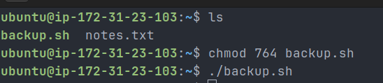

---

## Real Observations

- SSH service was active and running
- SSH was disabled at boot (systemctl is-enabled ssh → disabled)
- Fixed permission issue using chmod
- Docker service was not installed initially
- Installed Docker and verified it is running
- CPU usage was normal (no high usage process)
- Observed firewall (UFW) blocking some traffic in logs

---

## Key Learnings

- Always use sudo for system-level commands
- Logs (journalctl) are critical for debugging
- Services can be running but not enabled
- Permissions must include execute (x) to run scripts
- Troubleshooting should follow a step-by-step approach

---

## Hands-on Commands Used

```
systemctl status ssh
systemctl is-enabled ssh
sudo systemctl restart ssh
journalctl -u ssh -n 10

systemctl status docker
sudo apt install docker.io -y
journalctl -u docker -n 50
journalctl -u docker -f

top
ps aux --sort=-%cpu | head -10

ls
chmod +x backup.sh
./backup.sh

systemctl list-units --type=service | grep ssh
journalctl -xe
```

Supplementary troubleshooting output:

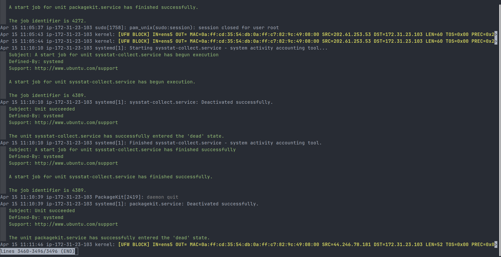

---

## Why This Matters for DevOps

- Helps locate logs and configs quickly
- Enables faster troubleshooting in production
- Builds strong debugging mindset
- Prepares for real-world incidents and interviews
