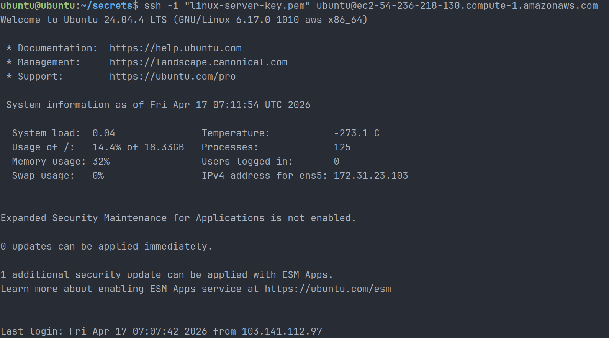
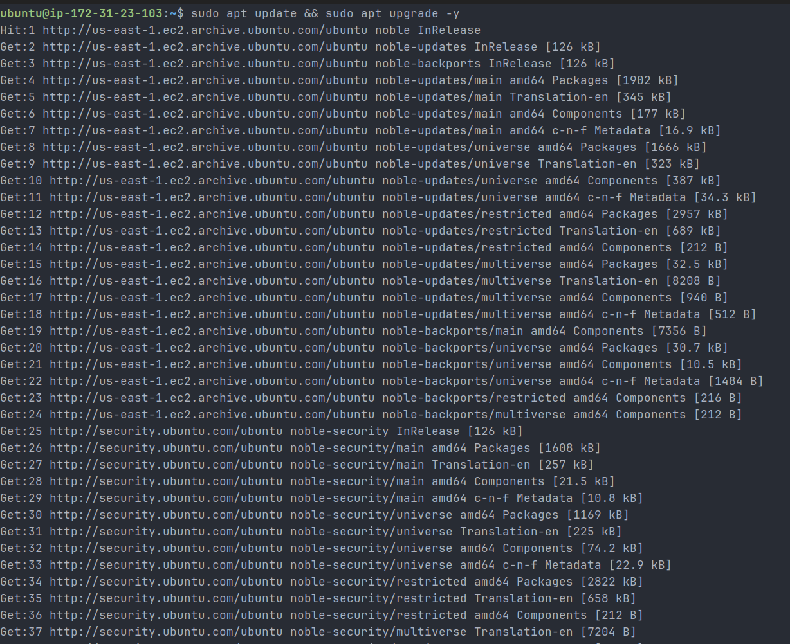
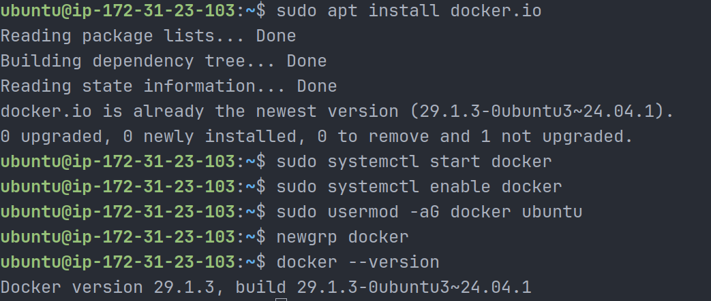
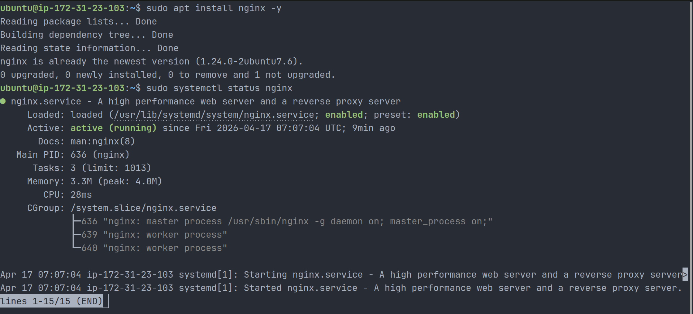
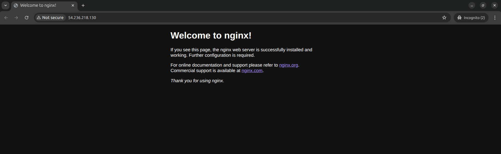
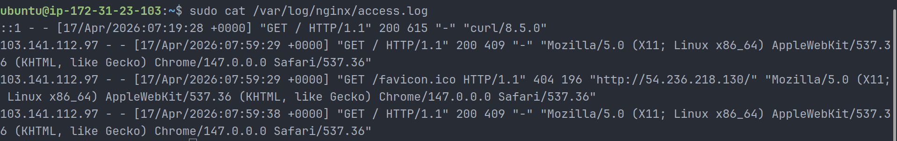

# Day 08 – Cloud Server Setup: Docker, Nginx & Web Deployment

## Overview

Deployed a production-style web server on AWS EC2. Connected via SSH, installed Docker and Nginx, configured security groups for HTTP access, validated service availability from the internet, and extracted Nginx access logs for analysis.

---

## Cloud Provider

AWS EC2 (Ubuntu 24.04 LTS)

---

## Architecture

- Compute: EC2 instance (public subnet)
- Access: SSH (port 22)
- Web Server: Nginx (port 80)
- Container Runtime: Docker
- Network Control: Security Group (inbound rules)

---

## Commands Used

### 1) Connect via SSH

```bash
ssh -i linux-server-key.pem ubuntu@ec2-54-236-218-130.compute-1.amazonaws.com
```



### 2) Update System

```bash
sudo apt update && sudo apt upgrade -y
```



### 3) Install & Configure Docker

```bash
sudo apt install docker.io -y
sudo systemctl start docker
sudo systemctl enable docker
sudo usermod -aG docker ubuntu
newgrp docker

docker --version
```



### 4) Install & Start Nginx

```bash
sudo apt install nginx -y
sudo systemctl start nginx
sudo systemctl enable nginx
sudo systemctl status nginx
```



### 5) Validate Locally (Service Check)

```bash
curl http://localhost
```

### 6) Check Port Binding

```bash
sudo ss -tulnp | grep 80
```

### 7) View Logs

```bash
sudo cat /var/log/nginx/access.log
sudo cat /var/log/nginx/error.log
```

### 8) Save Logs to File

```bash
sudo cat /var/log/nginx/access.log > ~/nginx-logs.txt
```

### 9) Download Logs to Local Machine

```bash
scp -i linux-server-key.pem ubuntu@54.236.218.130:~/nginx-logs.txt .
```

---

## Security Group Configuration

Inbound rules configured on the instance Security Group:

- SSH (22) → 0.0.0.0/0
- HTTP (80) → 0.0.0.0/0

---

## Validation

- Accessed web server via browser: [http://54.236.218.130](http://54.236.218.130)
- Verified Nginx serves default page
- Confirmed service locally using `curl http://localhost`
- Verified port 80 is listening on all interfaces (0.0.0.0:80)
- Confirmed logs are generated and downloadable



---

## Log File

Included file: `nginx-logs.txt`

Sample entries:

```text
GET / HTTP/1.1 200
GET /favicon.ico HTTP/1.1 404
```

Interpretation:

- 200 → Successful response from server
- 404 → Favicon not found (expected default behavior)

---

## Challenges Faced

### 1) Website not accessible (ERR_TIMED_OUT)

**Cause:** Port 80 not allowed in Security Group

**Resolution:**

- Added inbound rule for HTTP (port 80)
- Retested and verified public access



---

### 2) Understanding Local vs Public Access

**Observation:**

- `curl http://localhost` worked
- Browser access failed initially

**Learning:**

- Local success does not guarantee external accessibility
- Cloud firewall (Security Group) controls inbound traffic

---

## What I Learned

- How to launch and access EC2 instances via SSH
- Installing and managing services (Docker, Nginx)
- Importance of Security Groups in cloud networking
- Debugging approach: service → port → network
- Difference between localhost (127.0.0.1) and 0.0.0.0 binding
- Reading and interpreting web server logs

---

## Key DevOps Concepts Applied

- Infrastructure provisioning
- Remote server management
- Service deployment and validation
- Network troubleshooting
- Log analysis for observability

---

## Conclusion

Successfully deployed and exposed a web server on the internet using AWS EC2. Diagnosed and resolved a real-world networking issue by configuring Security Group rules. Validated the deployment using logs and multiple testing methods.

---

## Next Steps

- Run Nginx inside Docker container
- Deploy a custom HTML website
- Configure HTTPS using Let's Encrypt
- Set up monitoring (Prometheus + Grafana)
