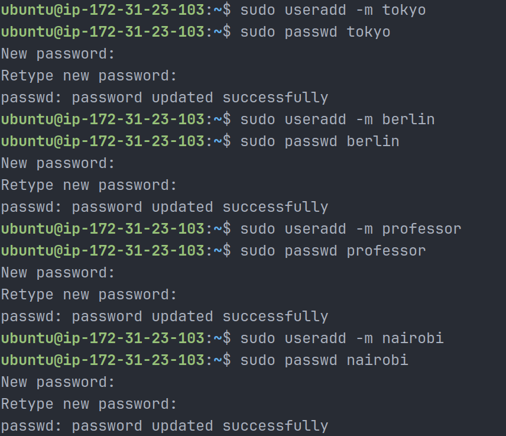
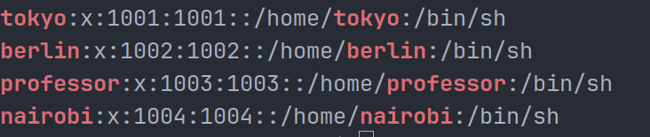
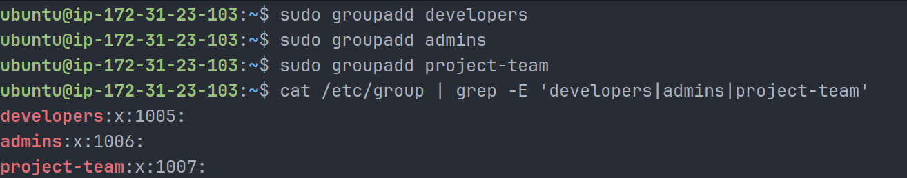
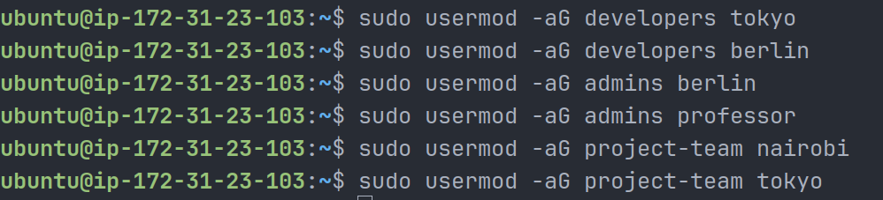
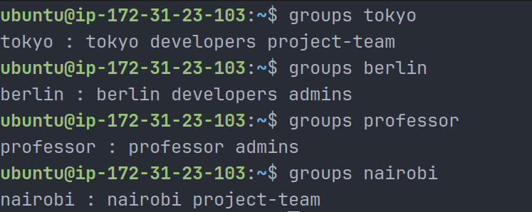
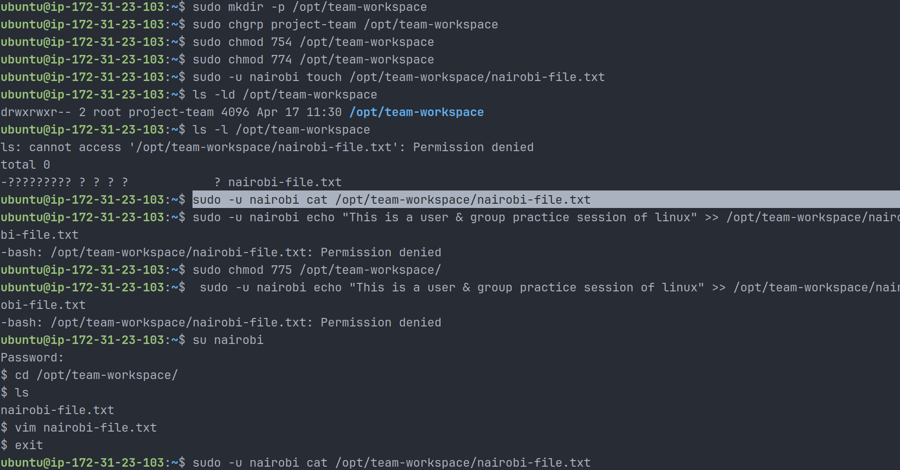
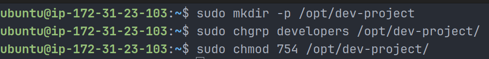
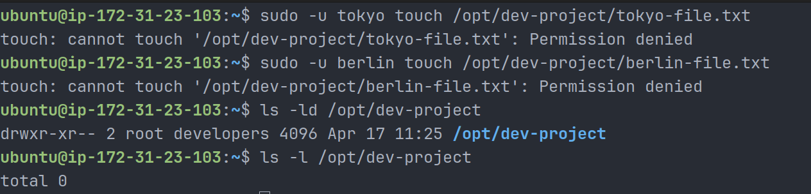
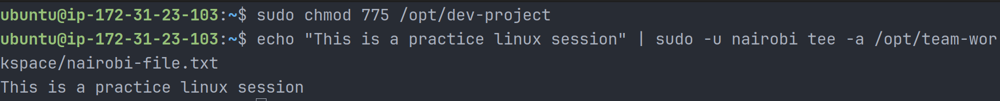

# Day 09 – Linux User & Group Management

## Overview

This challenge focused on practical Linux user and group management. The goal was to simulate real-world DevOps scenarios where multiple users collaborate on shared directories with proper permissions.

---

## Users & Groups Created

### Users

- tokyo
- berlin
- professor
- nairobi

### Groups

- developers
- admins
- project-team

---

## Group Assignments

- tokyo → developers, project-team
- berlin → developers, admins
- professor → admins
- nairobi → project-team

---

## Directories Created

| Directory           | Group        | Permissions |
| ------------------- | ------------ | ----------- |
| /opt/dev-project    | developers   | 775         |
| /opt/team-workspace | project-team | 775         |

---

## Commands Used

### Create Users

```bash
sudo useradd -m tokyo
sudo passwd tokyo

sudo useradd -m berlin
sudo passwd berlin

sudo useradd -m professor
sudo passwd professor

sudo useradd -m nairobi
sudo passwd nairobi
```

### Verify Users

```bash
cat /etc/passwd | grep -E 'tokyo|berlin|professor|nairobi'
ls /home/
```





### Create Groups

```bash
sudo groupadd developers
sudo groupadd admins
sudo groupadd project-team
```

### Verify Groups

```bash
cat /etc/group | grep -E 'developers|admins|project-team'
```



### Assign Users to Groups

```bash
sudo usermod -aG developers tokyo

sudo usermod -aG developers berlin
sudo usermod -aG admins berlin

sudo usermod -aG admins professor

sudo usermod -aG project-team nairobi
sudo usermod -aG project-team tokyo
```

### Verify Group Membership

```bash
groups tokyo
groups berlin
groups professor
groups nairobi
```





---

## Shared Directory Setup

### Dev Project Directory

```bash
sudo mkdir -p /opt/dev-project
sudo chgrp developers /opt/dev-project
sudo chmod 775 /opt/dev-project
```

### Test Access

```bash
sudo -u tokyo touch /opt/dev-project/tokyo-file.txt
sudo -u berlin touch /opt/dev-project/berlin-file.txt
```

### Verify

```bash
ls -ld /opt/dev-project
ls -l /opt/dev-project
```



---

## Team Workspace Setup

```bash
sudo mkdir -p /opt/team-workspace
sudo chgrp project-team /opt/team-workspace
sudo chmod 775 /opt/team-workspace
```

### Test Access

```bash
sudo -u nairobi touch /opt/team-workspace/nairobi-file.txt
```

### Fix for Shell Redirection Issue

```bash
echo "This is a practice linux session" | sudo -u nairobi tee -a /opt/team-workspace/nairobi-file.txt
```

### Verify

```bash
ls -ld /opt/team-workspace
ls -l /opt/team-workspace
```







---

## What I Learned

1. Difference between `usermod -G` and `usermod -aG`
2. Importance of correct directory permissions (775 vs 754/755)
3. Shell redirection (`>>`) does not work with `sudo` directly

---

## Real-World DevOps Insight

User and group management is critical in production systems where:

- Multiple engineers access shared resources
- Applications need proper permissions to write logs
- CI/CD pipelines require controlled access

Using correct group permissions and avoiding mistakes like removing users from groups or misconfiguring permissions can prevent outages.

---

## Best Practices

```bash
# Ensure group inheritance
sudo chmod g+s /opt/dev-project
```

- Ensures all new files inherit the group
- Prevents permission conflicts in team environments

---

## Conclusion

This exercise helped build a strong foundation in Linux access control, which is essential for managing servers, deployments, and collaborative environments in DevOps.
